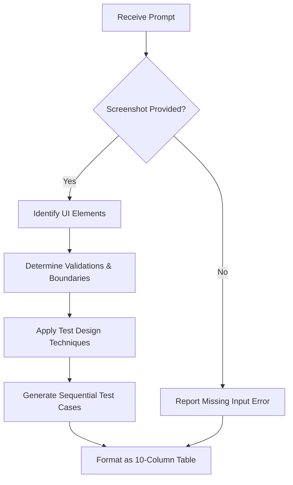

# Title & Metadata
**Feature / System Name**: UI Screenshot Test Case Generator & QA Plan
**Spec ID**: SPEC-QA-001
**Version**: 1.0
**Status**: Draft (Blocked - Missing Input)
**Spec Type**: QA Test Specification

# Overview & Purpose
The purpose of this specification is to define and generate a comprehensive suite of test cases based on a provided user interface screenshot. The generated test cases must cover all visible functionalities, UI elements, buttons, links, fields, validations, and navigation. The output is structured as a tabular test plan suitable for Excel export, applying standard test design techniques (Equivalence Partitioning, Boundary Value Analysis, Decision Table, State Transition, Error Guessing) to ensure robust positive and negative testing coverage.

# Goals
* Generate clear, simple, and non-duplicate test cases for all visible UI elements.
* Apply industry-standard test design techniques to ensure comprehensive coverage (positive, negative, boundary, and edge cases).
* Format the output strictly into a specified 10-column table for direct Excel integration.
* Avoid assumptions about backend or invisible functionality.

# Target Users
* **QA Engineers / Testers**: To execute the generated test cases.
* **Business Analysts / Product Managers**: To verify that the UI meets intended design and functional requirements.
* **Developers**: To understand the exact validation and boundary expectations of the UI elements.

# Stakeholders
* QA Lead
* Product Owner
* Development Team Lead

# Scope (In / Out)
**In Scope**:
* Visual analysis of the provided screenshot.
* Generation of test cases for visible UI elements (buttons, links, text fields, dropdowns, etc.).
* Identification of implied field validations and boundary conditions based on standard UI patterns.
* Positive and negative test scenarios.
* Expected error and success messages based on visual cues.
* Formatting output into the requested Excel-compatible table.

**Out of Scope**:
* Testing of functionality not visible in the screenshot.
* Backend, API, performance, or security testing.
* Automated test script generation (e.g., Selenium, Cypress code).

# MoSCoW Prioritization
* **Must Have**: Sequential Test Case IDs (TC_001, etc.), 10-column Excel-compatible format, application of specific test design techniques, coverage of all visible elements.
* **Should Have**: Detailed, step-by-step execution instructions for each test case.
* **Could Have**: Identification of state transitions if multiple UI states are implied.
* **Won't Have**: Assumptions about hidden menus, off-screen elements, or non-visual business logic.

# Functional Requirements
*Note: Because the source screenshot was not provided in the prompt, specific functional requirements for the UI cannot be derived. The requirements below define the expected behavior of the test generation process itself.*

* **REQ-01: UI Element Identification**
  * **Description**: The system must identify all interactive elements (buttons, links, inputs) visible in the provided screenshot.
  * **Acceptance Criteria**:
    * **Given** a valid UI screenshot, **When** analyzed, **Then** all visible interactive elements are listed for test generation.
    * **Given** no screenshot is provided, **When** analyzed, **Then** the system halts and reports missing input.

* **REQ-02: Test Design Technique Application**
  * **Description**: The system must apply Equivalence Partitioning, Boundary Value Analysis, Decision Tables, State Transitions, and Error Guessing to the identified elements.
  * **Acceptance Criteria**:
    * **Given** an identified text input field, **When** generating tests, **Then** boundary value and equivalence partitioning test cases are created.
    * **Given** a submit button, **When** generating tests, **Then** positive (success) and negative (error guessing) scenarios are created.

* **REQ-03: Excel-Compatible Export Formatting**
  * **Description**: Test cases must be output in a specific 10-column Markdown table.
  * **Acceptance Criteria**:
    * **Given** a generated set of test cases, **When** formatted, **Then** the table contains exactly the following columns: Test Case ID, Test Scenario, Test Case Description, Test Design Technique, Preconditions, Test Data, Test Steps, Expected Result, Priority, Test Type.

# User Stories
* **US-01**: As a QA Tester, I want to receive test cases in a structured 10-column format so that I can easily copy them into Excel or a Test Management Tool.
  * **Acceptance Criteria**: Given the test generation is complete, When I view the output, Then it is a Markdown table with the exact requested headers.
* **US-02**: As a QA Tester, I want both positive and negative scenarios included so that I can ensure the application handles invalid input gracefully.
  * **Acceptance Criteria**: Given a form field in the screenshot, When test cases are generated, Then there is at least one positive test and one negative test (e.g., invalid data format) documented.

# Inputs, Outputs & Data Flow
**Inputs**:
* Target UI Screenshot (Currently missing/null).

**Outputs**:
* Test Case Table (Markdown format).

**Data Flow**:

# Edge Cases & Error States
* **Missing Screenshot (Current State)**: The prompt requests analysis of a screenshot, but no image data or URL was provided. The system must gracefully report this failure rather than hallucinating UI elements.
* **Ambiguous UI Elements**: Elements that look like buttons but might be static graphics. (Handled via Error Guessing and noting assumptions in preconditions).
* **Unclear Field Constraints**: Text fields without visible labels or constraints. (Handled by applying standard Equivalence Partitioning for generic strings).

# Acceptance Criteria
* **Given** the requirement to generate a test case table, **When** the output is rendered, **Then** it must strictly adhere to the requested column structure and sequential ID format (TC_001, TC_002, etc.).
* **Given** the rule to not assume functionality, **When** no screenshot is provided, **Then** the output table must reflect the inability to generate specific tests rather than inventing a fake UI.

# Non-Functional Requirements
* **Formatting**: Output must be valid Markdown, specifically utilizing standard Markdown tables to ensure compatibility with copy-pasting into spreadsheet software.
* **Clarity**: Test steps must be written in imperative mood, clear, simple, and non-duplicate.

# Assumptions
* It is assumed the user intended to attach or upload an image file, but the current text-based interface did not capture or transmit the image payload.
* It is assumed that standard web/application UI patterns apply to the intended screenshot (e.g., red text indicates an error, asterisks indicate required fields).

# Dependencies
* Image parsing / multimodal capability to view the source screenshot.

# Open Questions
* **CRITICAL**: No screenshot was provided in the prompt. What is the specific application, screen, or UI that needs to be tested?
* Are there specific business rules, character limits, or backend constraints for the fields in the intended screenshot that cannot be deduced purely from visual inspection?
* What is the target platform for the UI (e.g., Web, iOS, Android, Desktop)? This affects standard UI interaction steps (e.g., "Click" vs. "Tap").

# Success Metrics
* 100% of visible interactive elements in the (future) screenshot have corresponding test cases.
* 0 instances of hallucinated or assumed functionality not present in the image.
* 100% compliance with the requested 10-column table format.

---

### Output: Test Case Table
*Note: Because the screenshot was not provided, the table below demonstrates the requested format and handles the current error state (Missing Input). Once the screenshot is provided, this table will be populated with the actual UI test cases.*

| Test Case ID | Test Scenario | Test Case Description | Test Design Technique | Preconditions | Test Data | Test Steps | Expected Result | Priority | Test Type |
| :--- | :--- | :--- | :--- | :--- | :--- | :--- | :--- | :--- | :--- |
| TC_001 | Image Upload Validation | Verify system behavior when screenshot is missing | Error Guessing | User submits prompt without image attachment | Null / No Image | 1. Submit prompt requesting visual analysis. 2. Do not attach any image file. | System identifies missing input and requests the screenshot without hallucinating UI elements. | High | Negative Testing |
| TC_002 | UI Element Identification | Verify all buttons and links are identified | Positive Testing | Valid screenshot is provided | [Pending Image] | 1. Provide valid screenshot. 2. Scan for interactive elements. | All visible buttons, links, and fields are documented as test targets. | High | Positive Testing |
| TC_003 | Field Boundary Validation | Verify boundary limits of visible text inputs | Boundary Value Analysis | Valid screenshot with text inputs provided | [Pending Image] | 1. Identify text input constraints. 2. Enter data at exact boundary limits. | Input is accepted or rejected according to visible UI constraints. | Medium | Positive/Negative |