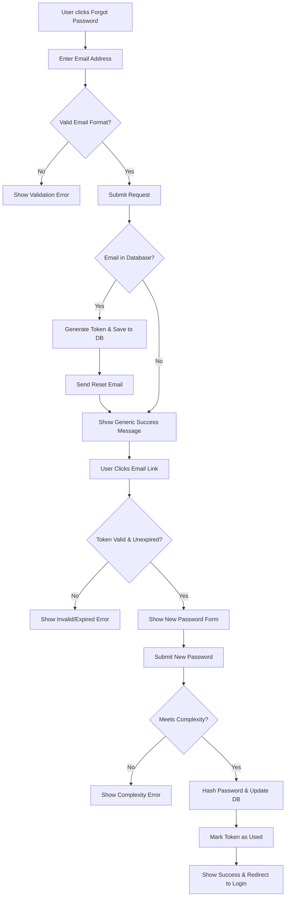

# Title & Metadata
**Feature / System Name:** User Password Reset Flow
**ID:** SPEC-AUTH-001
**Version:** 1.0
**Status:** Draft
**Type:** Core Functional Specification

# Overview & Purpose
The User Password Reset Flow provides a secure, self-service mechanism for registered users to regain access to their accounts if they forget their passwords. This feature ensures users can recover their accounts without manual intervention from customer support, utilizing a time-bound, single-use token sent via email.

# Goals
- Provide a frictionless, self-service account recovery experience for users.
- Reduce password-related customer support tickets by 80%.
- Ensure account recovery meets industry-standard security practices, specifically preventing account enumeration and token reuse.

# Target Users
- **Registered Users:** Individuals who have an existing account but cannot remember their credentials.
- **Customer Support (Indirect):** Benefiting from a reduced volume of manual password reset requests.

# Stakeholders
- Product Management
- Security / InfoSec Team
- Customer Support Lead

# Scope (In / Out)
**In Scope:**
- "Forgot Password" request page and form.
- Generation and database storage of secure, time-bound reset tokens.
- Dispatching reset emails via the existing email provider.
- Password reset form (token validation and new password submission).
- Updating the user's password hash in the database.

**Out of Scope:**
- SMS or Authenticator-based account recovery.
- "Change Password" flow for already authenticated users (handled in Account Settings).
- Magic link passwordless login.

# MoSCoW Prioritization
- **Must Have:** Email submission form, secure token generation, email dispatch, token validation, password update functionality.
- **Should Have:** Rate limiting on reset requests to prevent spam and abuse.
- **Could Have:** Audit logging of reset requests for security monitoring.
- **Won't Have:** Alternative delivery methods (e.g., SMS, WhatsApp) for this release.

# Functional Requirements
- **FR1: Request Reset:** The system must provide a form accepting an email address to initiate the reset process.
- **FR2: Token Generation:** The system must generate a cryptographically secure, single-use token associated with the user's account, expiring in 15 minutes.
- **FR3: Email Dispatch:** The system must send an email containing a unique reset link to the provided address if it matches an active account.
- **FR4: Anti-Enumeration:** The system must display the identical success message regardless of whether the submitted email exists in the system.
- **FR5: Token Validation:** The system must validate the token's existence, expiration, and usage status when the reset link is accessed.
- **FR6: Password Update:** The system must accept a new password, validate it against complexity rules, hash it, and update the user record.

# User Stories
**Story 1: Requesting a reset link**
As a Registered User, I want to request a password reset link by entering my email so that I can start the recovery process.
- **Given** I am on the login page
- **When** I click "Forgot Password" and submit my email address
- **Then** I see a confirmation message instructing me to check my email, and the system dispatches an email if my account exists.

**Story 2: Setting a new password**
As a Registered User, I want to click a link in my email to securely set a new password so that I can log in again.
- **Given** I have received a password reset email
- **When** I click the reset link
- **Then** I am taken to a secure page where I can enter and confirm a new password.

**Story 3: Token expiration security**
As a Registered User, I want my reset link to expire after a short time so that my account remains secure if my email is compromised later.
- **Given** 15 minutes have passed since I requested a reset
- **When** I click the reset link in my email
- **Then** I am informed the link has expired and am provided a button to request a new one.

# Inputs, Outputs & Data Flow
**Inputs:**
- User Email Address (string, email format)
- New Password (string, masked)
- Confirm New Password (string, masked)

**Outputs:**
- Password Reset Email (HTML/Text)
- UI Success/Error Messages

**Data Entities / Models Touched:**
- `User`: 
  - Read: Find by email.
  - Update: `password_hash`, `updated_at`.
- `PasswordResetToken`: 
  - Create: `token_hash`, `user_id`, `expires_at`.
  - Update: `used_at` (to invalidate after successful reset).

# Flows & Diagrams

# Edge Cases & Error States
- **Unregistered Email:** If a user submits an email not in the database, the system acts as if successful to prevent enumeration. No email is sent, and no token is generated.
- **Expired Token:** If a user clicks a link after the 15-minute window, the system displays a "Link expired" error state and offers a button to navigate back to the "Forgot Password" request page.
- **Used Token:** If a user clicks a link that has already been used to successfully reset a password, the system displays a "Link already used" error state.
- **Rate Limiting:** If a user submits the forgot password form more than 5 times in 5 minutes from the same IP or for the same email, the system blocks further requests for 15 minutes and displays "Too many requests. Please try again later."
- **Password Mismatch:** If "New Password" and "Confirm Password" do not match, the UI prevents submission and displays an inline error.

# Acceptance Criteria
- **Given** a user submits a valid, registered email, **When** the system processes the request, **Then** a token is generated in the database and an email is dispatched to the user within 5 seconds.
- **Given** a user submits an unregistered email, **When** the system processes the request, **Then** the UI shows the exact same success message as a registered email, and no reset token is generated.
- **Given** a user accesses a valid reset link, **When** they submit a password that fails complexity rules, **Then** the system rejects the update, does not invalidate the token, and displays specific complexity requirements.
- **Given** a user successfully updates their password, **When** they attempt to use the same reset link again, **Then** the system denies access and states the link has already been used.
- **Given** a user triggers the rate limit threshold, **When** they attempt to request another reset, **Then** the system rejects the request and displays a rate limit warning.

# Non-Functional Requirements
- **Security:** Passwords must be hashed using bcrypt or Argon2. Tokens must be generated using a cryptographically secure pseudo-random number generator (CSPRNG) and only the hashed version of the token should be stored in the database.
- **Performance:** The forgot password request must return a UI response in < 500ms to prevent timing attacks that could reveal if an email exists.
- **Reliability:** Email delivery must have a 99.9% success rate via the integrated provider.

# Assumptions
- An email delivery service (e.g., SendGrid, AWS SES) is already integrated and available for use by the backend.
- The application already has a defined password complexity policy (e.g., minimum 8 characters, 1 uppercase, 1 number) that can be reused for validation.
- The system uses a relational database for user management.

# Dependencies
- Third-party Email Provider API.
- Frontend routing for the `/forgot-password` and `/reset-password` views.

# Open Questions
- What is the exact copy/HTML template for the password reset email?
- What are the exact password complexity rules we are enforcing for this specific application?
- Should active user sessions (if any exist on other devices) be automatically invalidated when a password is reset?

# Success Metrics
- **KPI 1:** 95% completion rate for initiated password resets (measured as successful password updates divided by valid reset emails sent).
- **KPI 2:** 80% reduction in customer support tickets categorized under "Cannot log in / Forgot Password" within 30 days of launch.